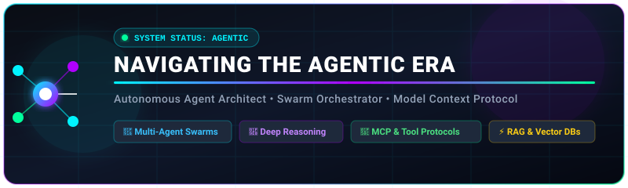

<div align="center">
  

  <br/><br/>

  [](https://github.com/djm204?tab=repositories)
  [](https://github.com/djm204/frankenbeast)
  [](https://github.com/djm204/mcp-servers)

</div>

---

### 👋 Hi, I'm David (`djm204`)

I engineer **deterministic agent runtimes**, **modular multi-agent systems**, and **tool-augmented LLM infrastructure**.

My work focuses on transforming stochastic language models into reliable software systems by enforcing strict type boundaries, multi-loop orchestration (planning, execution, critique, and governance), and standardized Model Context Protocol (MCP) integrations.

---

### 🧠 High-Level Focus & Architecture

- ⚡ **Deterministic Agent Runtimes**: Building structured execution engines with strict runtime validation (`Zod`), bounded iteration loops, and real-time observability.
- 🔁 **Multi-Loop Orchestration**: Designing interlocking loops for task planning, execution, self-reflection/critique, and human-in-the-loop governance.
- 🔌 **Tool Protocols & MCP**: Authoring Model Context Protocol (MCP) servers and proxies that bridge foundation models safely to filesystem, web, and CLI tools.
- 🤖 **Automated Engineering Workflows**: Developing self-correcting agents for automated codebase refactoring, pull request reviews, and issue triage.

---

### 🗺️ System Architecture Pattern

```
                        ┌──────────────────────────────────────────────┐
                        │          🎯 REASONING & TASK INPUT           │
                        └──────────────────────┬───────────────────────┘
                                               │
                                               ▼
                        ┌──────────────────────────────────────────────┐
                        │         🦖 AGENTIC ORCHESTRATION LOOP        │
                        │     (Planning • Execution • Reflection)      │
                        └──────┬───────────────┬───────────────┬───────┘
                               │               │               │
         ┌─────────────────────┘               │               └─────────────────────┐
         ▼                                     ▼                                     ▼
┌─────────────────┐                   ┌──────────────────┐                  ┌──────────────────┐
│ 🧠 State & Memory│                   │📋 Task Decomposition│                 │🧪 Self-Reflection│
│ (Vector/SQLite) │                   │(Execution Trees) │                  │ & Quality Gating │
└─────────────────┘                   └──────────────────┘                  └──────────────────┘
         │                                     │                                     │
         └─────────────────────┬───────────────┴───────────────┬─────────────────────┘
                               │                               │
                               ▼                               ▼
                    ┌─────────────────────┐         ┌─────────────────────┐
                    │🔌 MCP Tool Integration│       │🛡️ Safety & Governance│
                    │(APIs, Web & CLI Ops)│         │ (HITL & Policy Ops) │
                    └─────────────────────┘         └─────────────────────┘
```

---

### 🧰 Core Engineering Stack

<div align="center">

| Layer | Technologies & Frameworks |
| :--- | :--- |
| **Languages & Runtimes** | TypeScript, Node.js, Python, PyTorch, C++ |
| **Agent Architecture** | Custom Monorepo Runtimes, LangGraph, AutoGen, Ollama |
| **Protocols & Validation** | Model Context Protocol (MCP), Zod Schemas, REST/WebSockets |
| **Tooling & Storage** | Vitest, Turborepo, Docker, SQLite, ChromaDB |

</div>

---

### 📂 Key Projects

- 🦖 **[Frankenbeast](https://github.com/djm204/frankenbeast)** — Modular deterministic agent runtime & Turborepo framework.
- 🐝 **[SmartSwarm](https://github.com/djm204/smart-swarm)** — Multi-agent swarm orchestration platform.
- 🤖 **[hermes-agent](https://github.com/djm204/hermes-agent)** — Autonomous review and workflow agent.
- 🔌 **[mcp-servers](https://github.com/djm204/mcp-servers)** & **[mcp-web](https://github.com/djm204/mcp-web)** — Custom Model Context Protocol tool suite.
- 🛠️ **[codex-review](https://github.com/djm204/codex-review)** — Reusable review loops for automated PR gating.
- 🧩 **[agent-skills](https://github.com/djm204/agent-skills)** — Custom skill templates for AI agent coding.
- ⚡ **[ollama-orchestrator](https://github.com/djm204/ollama-orchestrator)** — Lightweight local LLM orchestration.

---

### 📫 Connect

<div align="center">

[](https://github.com/djm204)
[](https://davidmendez.dev)

</div>

<br/>

<div align="center">
  <sub>⚡ Building deterministic agent infrastructure & modular LLM tooling</sub>
</div>
